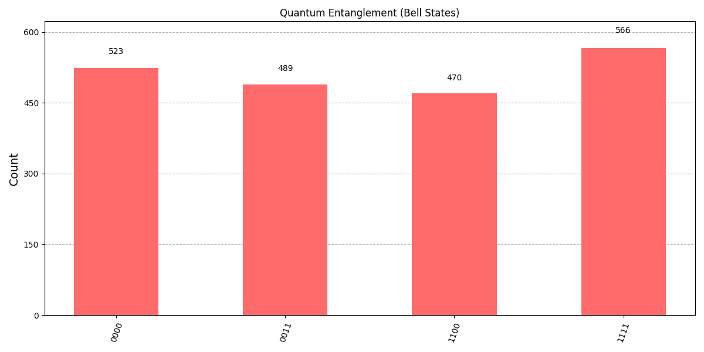
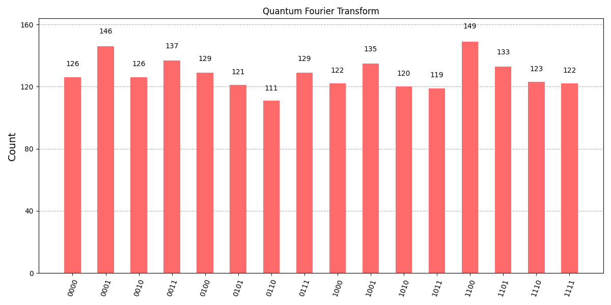
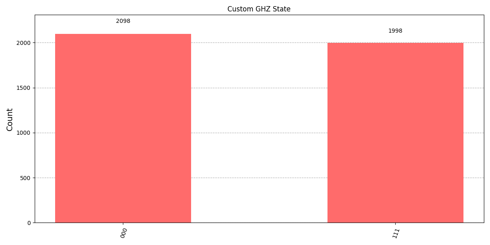
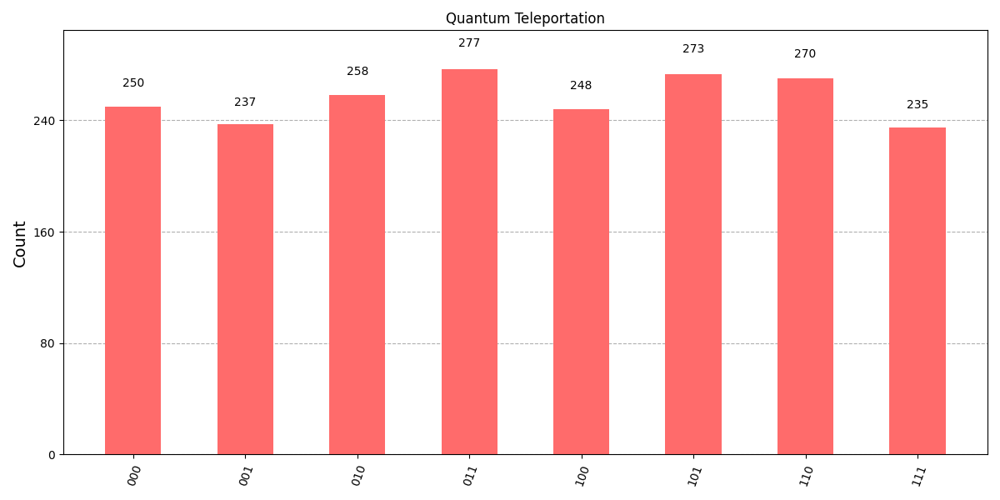
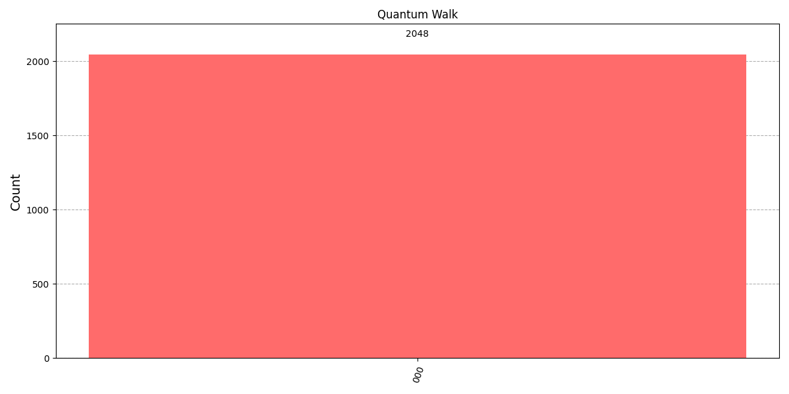
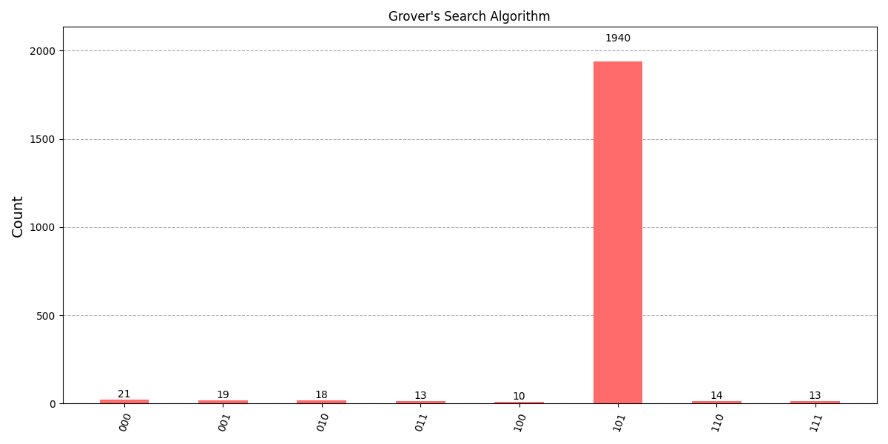
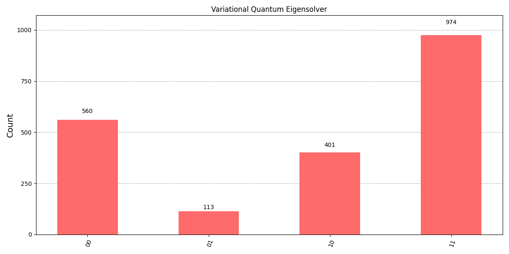
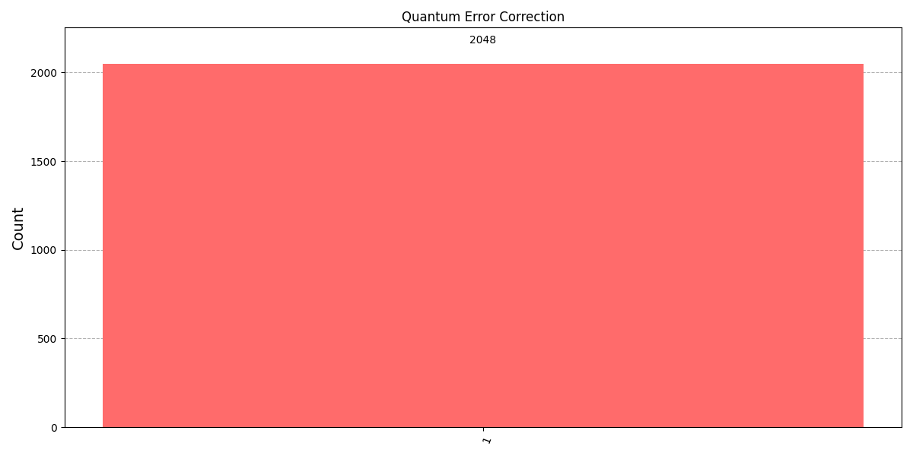

# Advanced Quantum Computing Application

Aplikasi Quantum Computing Canggih dengan Multiple Algorithms menggunakan **Qiskit**.


|  |  | |
|-----------------------------------------|-------------------------------------------|-------------------------------|
|                   |     |        |
|         |     |  |


## Deskripsi
Project ini menampilkan berbagai algoritma quantum canggih:
- Quantum Entanglement (Bell States)
- Quantum Teleportation
- Grover's Search Algorithm
- Quantum Fourier Transform (QFT)
- Quantum Phase Estimation
- Variational Quantum Eigensolver (VQE)
- Quantum Random Walk
- Quantum Error Correction

Project ini menggunakan **Python 3**, **Qiskit**, dan **Matplotlib** untuk visualisasi hasil.

## Installation

Follow these steps to set up the Advanced Quantum Computing Application:

### 1. Clone the repository

```bash
git clone https://github.com/rasidi3112/Advanced-Quantum-App.git
cd Advanced-Quantum-App

# Create a virtual environment named 'venv'
python3 -m venv venv
-
# Activate the virtual environment
# On macOS/Linux:
source venv/bin/activate
# On Windows (PowerShell):
venv\Scripts\Activate.ps1
-
pip install -r requirements.txt
-
python main.py


😊🫰
